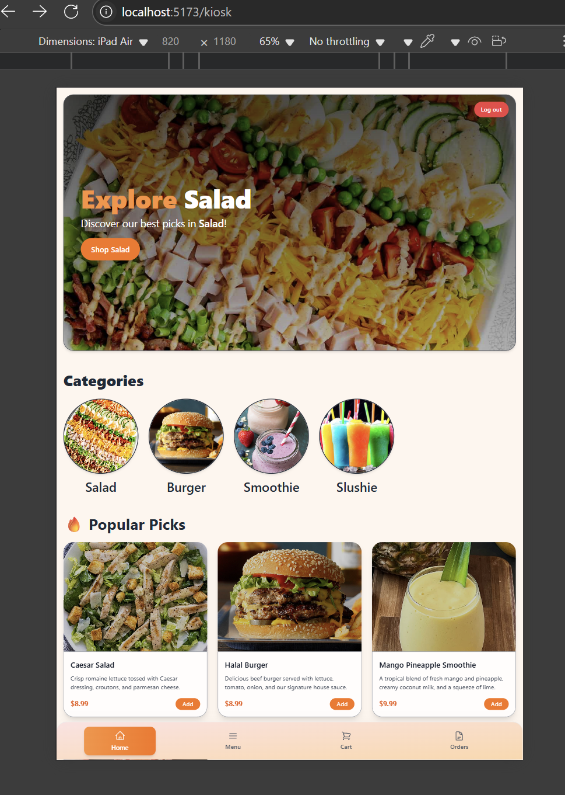
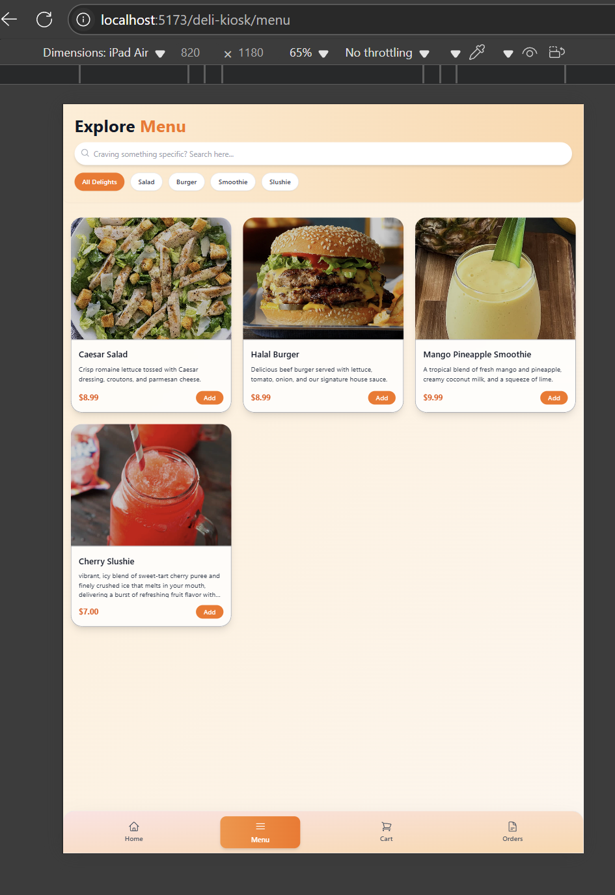
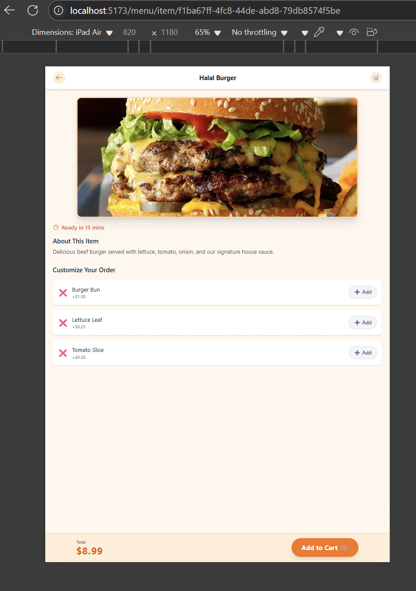
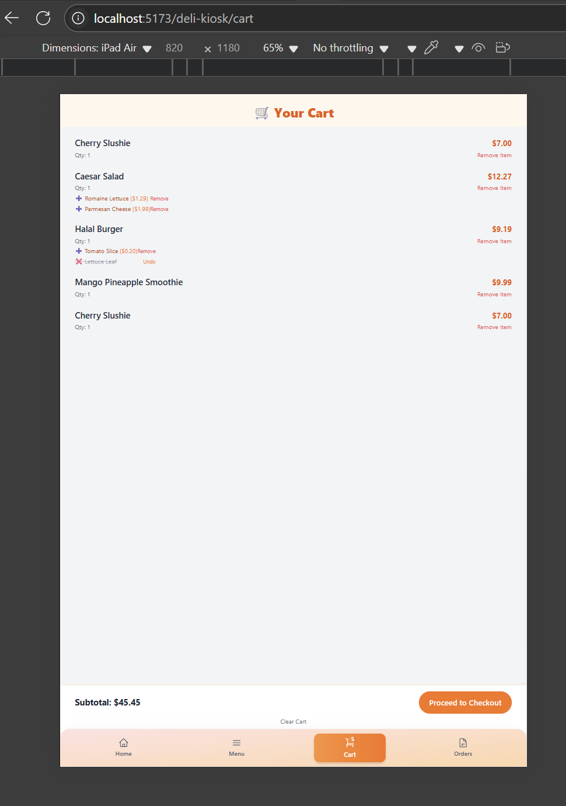
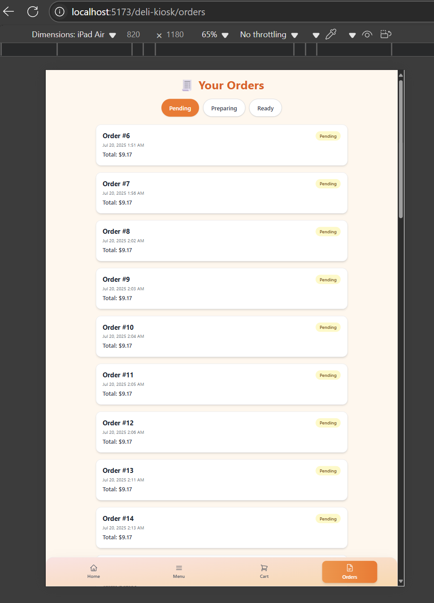

  

<h1 align="center">SliceLine 🍕 — Self‑Service Deli & Kiosk Ordering Platform</h1>

  <em>
    This repository contains <strong>screenshots and documentation only</strong>. 
    The production source code is hosted in a private repo. 
    To request access, please email&nbsp;
    <a href="mailto:algaithyammar@gmail.com">algaithyammar@gmail.com</a>.
  </em>

  Touch‑first ordering · Real‑time kitchen display · Cash & card checkout · Admin dashboard

---

## 📸 Preview

| Kiosk Home | Menu | Menu Item | Cart Overlay | Admin Orders Page |
|------------|----------------------|--------------|-------------------|
|  |  |  |  |  |

---

## ✨ Key Features

- **Full‑screen kiosk UI** with large tap targets, hero slider, animated category bubbles, and horizontal “Popular” carousel.  
- **Customizable orders**: ingredient toggles, extra add‑ons, dynamic price recalculation.  
- **Smooth cart flow**: overlay panel, quantity controls, cash or card checkout, animated confirmation modals.  
- **Cash‑order staging**: unconfirmed cash orders stored in a temp table for cashier approval.  
- **Kitchen & cashier dashboards** with tabbed order boards (`Pending → Preparing → Ready`).  
- **Admin console** for products, clients, multi‑supplier pricing, and notifications.  
- **Modern stack**: React 19 · TypeScript · Redux Toolkit · Tailwind CSS · Framer Motion · ASP.NET Core 8 · EF Core · SQLite / SQL Server.

---

## 🛠 Tech Stack

| Layer        | Tech                                                                      |
|--------------|---------------------------------------------------------------------------|
| **Frontend** | React 19, TypeScript, Redux Toolkit, Tailwind CSS, Framer Motion, Axios   |
| **Backend**  | ASP.NET Core 8 Web API, Entity Framework Core, Microsoft Identity         |
| **Database** | SQLite (dev) / SQL Server (prod)                                          |
| **Auth**     | JWT bearer tokens with role‑based policies                                |
| **Dev Ops**  | GitHub Actions CI, Docker Compose (optional), Nginx reverse proxy         |

---

## 🗺 Architecture

1. **Kiosk & mobile clients** call the ASP.NET Core API.  
2. **TempCashOrder** flow intercepts cash checkouts before conversion to permanent orders.  
3. **Admin SPA** shares the same API and Auth server.  
4. Events are logged centrally via an `AppLog` entity for audit and troubleshooting.

---

## 🚀 Getting Started

This repository is an **overview only**.  
The full source code lives in a private repo. To request access, email **algaithyammar@gmail.com**.

---

## 📈 Roadmap

- [x] Kiosk ordering MVP  
- [x] Cash‑order cashier workflow  
- [x] Admin panels (products, clients, orders, notifications) 
- [ ] Reporting & analytics (sales heatmaps, ingredient usage)  
- [ ] Internationalization (Arabic & Spanish)

---

## 🙌 Contributing

Have design feedback or feature ideas? Open an issue here or reach out:

- **Email:** algaithyammar@gmail.com  
- **LinkedIn:** [Ammar Algaithy](https://linkedin.com/in/ammar-algaithy)

Code contributions occur in the private SliceLine repo via pull requests.

---

## 📜 License

The content of this overview repository is released under the **MIT License**.  
Source code in the private SliceLine repository is proprietary to Ammar Algaithy.
